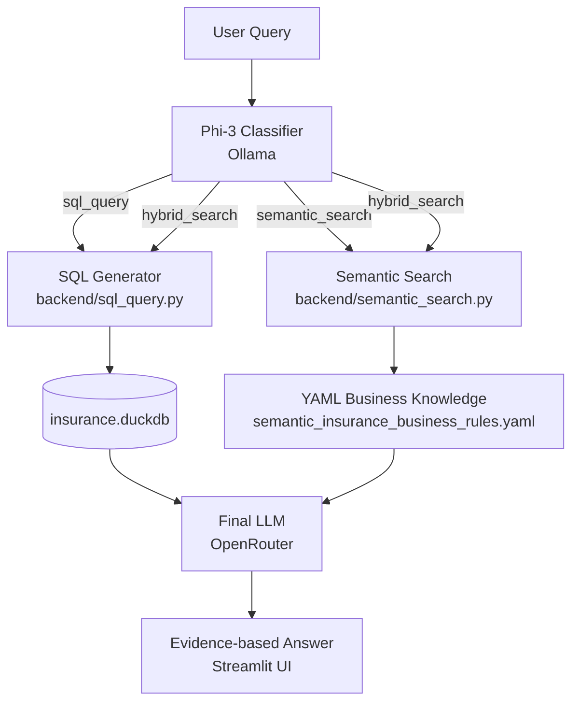
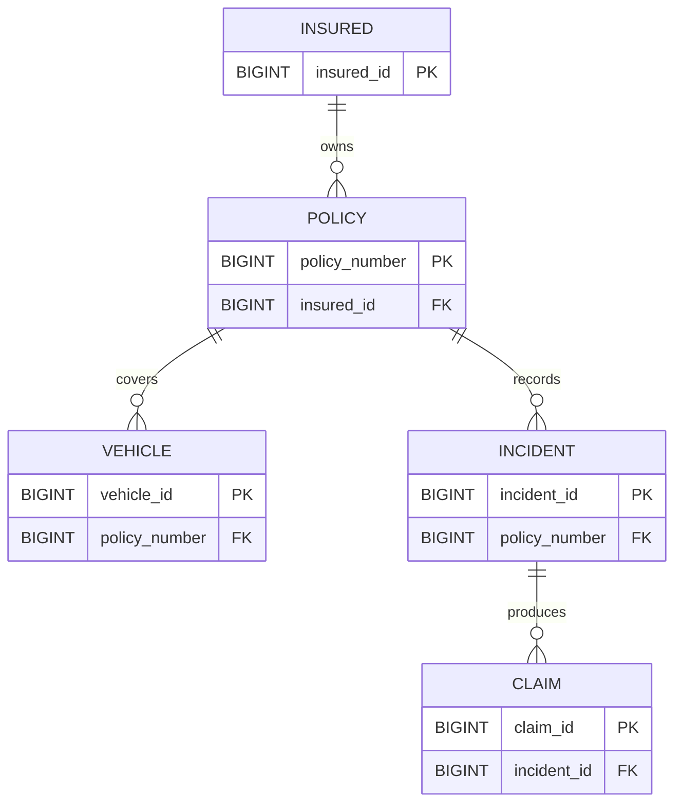

# 🛡️ Cognexa

### Explainable insurance claims investigation through natural-language access to structured data and business rules.

## Badges


> Cognexa is currently a local prototype. No open-source license has been added to this repository yet.

## Project Overview

Cognexa is an AI-powered insurance claims investigation and policy intelligence assistant. Users ask questions in natural language about claims, policies, incidents, insured customers, vehicles, fraud indicators, and investigation rules.

The application classifies each question as `sql_query`, `semantic_search`, or `hybrid_search`. It retrieves evidence from the local DuckDB database, the YAML business-knowledge layer, or both, then passes that evidence to a final LLM for a concise answer in Streamlit.

## Problem Statement

Insurance investigation work often combines structured records with rules that live in documents or team knowledge. Investigators may need to search claim data manually, interpret scattered procedures, and explain why a case deserves attention. A fraud label, an investigation warning, and a business rule are related but are not the same thing.

Cognexa addresses this gap by making the data queryable in plain language while keeping the answer tied to database values and explicit business knowledge.

## Solution

Cognexa uses a lightweight routing architecture:

- Local Phi-3 through Ollama classifies the question.
- DuckDB stores and queries relational insurance data.
- `all-MiniLM-L6-v2` embeds business-knowledge passages for semantic retrieval.
- `semantic_insurance_business_rules.yaml` stores rules, entities, relationships, metrics, and question patterns.
- An OpenRouter model produces the final answer from the retrieved context.

## Key Features

- Natural-language questions over insurance records
- Read-only SQL generation and validation
- Automatic SQL correction after DuckDB validation errors
- Semantic retrieval of business rules and investigation guidance
- Hybrid answers combining database evidence with business rules
- Fraud analysis without treating every warning as proof of fraud
- Policy and claims intelligence in one interface
- Supporting SQL, tabular results, and retrieved passages in Streamlit

## Architecture



## Query Processing Flow

### SQL Query

1. `classifier.py` routes the question to `sql_query`.
2. `sql_query.py` asks Phi-3 to produce one read-only `SELECT` statement using the known schema and join paths.
3. The statement is validated, explained, and executed against `insurance.duckdb` in read-only mode.
4. Query results are passed to the final LLM and shown in the UI.

### Semantic Search

1. `classifier.py` routes the question to `semantic_search`.
2. `semantic_search.py` loads the YAML knowledge base and turns its rules, patterns, categories, and objectives into passages.
3. `all-MiniLM-L6-v2` embeds the passages and the user question.
4. Cosine similarity selects relevant passages above the configured threshold.
5. The final LLM answers using the retrieved business context.

Embeddings allow a question to match the meaning of a rule even when it does not use the rule's exact wording.

### Hybrid Search

Hybrid questions need both a record-level fact and a rule-level interpretation, such as whether a particular claim meets an investigation condition. Cognexa runs the SQL and semantic paths, then gives the final LLM both contexts so it can distinguish what the database says from what the business rules recommend.

## AI Pipeline

| Component            | Role                                                                    |
| -------------------- | ----------------------------------------------------------------------- |
| Phi-3 via Ollama     | Classifies questions and generates DuckDB SQL locally                   |
| `all-MiniLM-L6-v2` | Creates embeddings for semantic business-rule retrieval                 |
| DuckDB               | Stores and queries insured, policy, vehicle, incident, and claim tables |
| YAML knowledge layer | Stores semantic business knowledge and investigation guidance           |
| OpenRouter model     | Produces the final answer from the supplied evidence                    |

## Technology Stack

| Layer                  | Technology             | Purpose                                           |
| ---------------------- | ---------------------- | ------------------------------------------------- |
| Interface              | Streamlit              | Local interactive application                     |
| Routing and generation | LangChain Core, Ollama | Prompt chains, classification, and SQL generation |
| Structured data        | DuckDB                 | Read-only claim and policy queries                |
| Semantic retrieval     | Sentence Transformers  | Embedding and cosine-similarity search            |
| Knowledge format       | YAML / PyYAML          | Business rules and semantic metadata              |
| Data preparation       | pandas, openpyxl       | Optional Excel-to-DuckDB rebuild workflow         |

## Database Schema and Connection

Cognexa uses DuckDB as its local structured-data layer. The active application connects to `insurance.duckdb` from `backend/sql_query.py` and opens it in read-only mode before validating and executing generated SQL.

### Tables

<small>The following attributes were read from the active  database. Types are included for reference.</small>

| Object                              | Attributes                                                                                                                                                                                                                                                                                                                                                                                                                                                | Key relationships                                                                                                              |
| ----------------------------------- | --------------------------------------------------------------------------------------------------------------------------------------------------------------------------------------------------------------------------------------------------------------------------------------------------------------------------------------------------------------------------------------------------------------------------------------------------------- | ------------------------------------------------------------------------------------------------------------------------------ |
| `insured`                         | <small>insured_id (BIGINT), age (BIGINT), gender (VARCHAR), occupation (VARCHAR), insured_zip (VARCHAR), hobbies (VARCHAR), relationship (VARCHAR), education_level (VARCHAR), capital_gains (DOUBLE), capital_loss (DOUBLE), monthly_income (DOUBLE)</small>                                                                                                                                                                                             | Primary key:`insured_id`Referenced by `policy.insured_id`                                                                  |
| `policy`                          | <small>policy_number (BIGINT), insured_id (BIGINT), months_as_customer (BIGINT), policy_bind_date (DATE), policy_state (VARCHAR), policy_csl (VARCHAR), policy_deductible (DOUBLE), policy_annual_premium (DOUBLE), umbrella_limit (DOUBLE), auto_year (BIGINT)</small>                                                                                                                                                                                   | Primary key:`policy_number`Foreign key: `insured_id`Referenced by `vehicle.policy_number` and `incident.policy_number` |
| `vehicle`                         | <small>vehicle_id (BIGINT), policy_number (BIGINT), auto_make (VARCHAR), auto_model (VARCHAR), auto_year (BIGINT)</small>                                                                                                                                                                                                                                                                                                                                 | Primary key:`vehicle_id`Foreign key: `policy_number`                                                                       |
| `incident`                        | <small>incident_id (BIGINT), policy_number (BIGINT), incident_date (DATE), incident_type (VARCHAR), collision_type (VARCHAR), incident_severity (VARCHAR), authorities_contacted (VARCHAR), incident_state (VARCHAR), incident_city (VARCHAR), incident_location (VARCHAR), incident_hour_of_day (BIGINT), vehicles_involved (BIGINT), property_damage (VARCHAR), bodily_injuries (BIGINT), witnesses (BIGINT), police_report_available (VARCHAR)</small> | Primary key:`incident_id`Foreign key: `policy_number`Referenced by `claim.incident_id`                                   |
| `claim`                           | <small>claim_id (BIGINT), incident_id (BIGINT), total_claim_amount (DOUBLE), injury_claim (DOUBLE), property_claim (DOUBLE), vehicle_claim (DOUBLE), fraud_reported (VARCHAR)</small>                                                                                                                                                                                                                                                                     | Primary key:`claim_id`Foreign key: `incident_id`                                                                           |
| `insurance_claim_analysis` (view) | <small>insured_id (BIGINT), age (BIGINT), gender (VARCHAR), policy_number (BIGINT), policy_state (VARCHAR), incident_id (BIGINT), incident_type (VARCHAR), incident_severity (VARCHAR), claim_id (BIGINT), total_claim_amount (DOUBLE), injury_claim (DOUBLE), property_claim (DOUBLE), vehicle_claim (DOUBLE), fraud_reported (VARCHAR)</small>                                                                                                          | Read-only joined view across`insured`, `policy`, `incident`, and `claim`                                               |

### Relationship Diagram



The valid join paths used by SQL generation are:

```text
claim -> incident -> policy -> insured
claim -> incident -> policy -> vehicle
```

Claims must be joined to vehicles through `incident` and `policy`; Cognexa does not join `claim` directly to `vehicle`.

### Application Connection

The application resolves the database path relative to the project root, so it can be started from the repository root with:

```python
DATABASE_PATH = PROJECT_ROOT / "insurance.duckdb"

with duckdb.connect(
    str(DATABASE_PATH),
    read_only=True,
) as connection:
    results = connection.execute(sql).fetchdf()
```

The checked-in `insurance.duckdb` is the database used by the active Streamlit application. `load_cleaned_data_to_duckdb.py` creates a separate `insurance_project.duckdb` from an Excel workbook; that output is used by the optional data-preparation workflow and is not the database currently queried by `backend/main.py`.

## Repository Structure

```text
Cognexa/
├── backend/
│   ├── classifier.py
│   ├── main.py
│   ├── semantic_search.py
│   ├── sql_query.py
│   └── test.py
│
├── data/
│   ├── cleaned_data.xlsx
│   └── semantic_insurance_business_rules.yaml
│
├── notebook/
│   ├── 01_data_exploration.ipynb
│   └── cognexa.ipynb
│
├── insurance.duckdb
├── insurance_duckdb_schema.sql
├── load_cleaned_data_to_duckdb.py
├── query_database.py
├── query_duckdb.py
├── test_duckdb.py
├── requirements.txt
├── .env
├── venv/
└── README.md
```

| File                                            | Purpose                                                        |
| ----------------------------------------------- | -------------------------------------------------------------- |
| `backend/main.py`                             | Streamlit application and route orchestration                  |
| `backend/classifier.py`                       | Classifies questions into the three supported paths            |
| `backend/sql_query.py`                        | Generates, validates, repairs, and executes read-only SQL      |
| `backend/semantic_search.py`                  | Loads, embeds, and searches YAML business knowledge            |
| `data/semantic_insurance_business_rules.yaml` | Business rules and semantic knowledge source                   |
| `insurance.duckdb`                            | Database used by the active application                        |
| `load_cleaned_data_to_duckdb.py`              | Rebuilds a DuckDB database from a five-sheet Excel workbook    |
| `query_database.py`                           | Simple query against the checked-in database and analysis view |

The notebooks and `frontend/app.py` are supporting or historical prototypes, not dependencies of the active application. `query_duckdb.py` targets the alternate `insurance_project.duckdb` output created by the loader.

## Installation

Prerequisites:

- Python 3.10 or newer
- Git
- Ollama
- An OpenRouter API key for final answer generation

```powershell
git clone <repository-url>
cd Cognexa
python -m venv venv
.\venv\Scripts\Activate.ps1
python -m pip install --upgrade pip
pip install -r requirements.txt
```

Install and prepare Phi-3 with Ollama:

```powershell
ollama pull phi3
ollama serve
```

The semantic model `all-MiniLM-L6-v2` is downloaded by `sentence-transformers` when `backend/semantic_search.py` first loads it. The checked-in `insurance.duckdb` and YAML knowledge base are already used by the active app.

## Environment Variables

Create a local `.env` file in the project root. Never commit credentials.

```env
OPENROUTER_API_KEY=your_openrouter_api_key
```

The application also uses Ollama at `http://localhost:11434`, which is the default local endpoint configured in `backend/sql_query.py`.

## Running Locally

Start the active application from the repository root:

```powershell
streamlit run backend/main.py
```

Open the local URL printed by Streamlit, normally `http://localhost:8501`.

To rebuild the optional DuckDB database from Excel, place `cleaned_insurance_dataset.xlsx` in the project root. It must contain sheets named `insured`, `policy`, `vehicle`, `incident`, and `claim`.

```powershell
python load_cleaned_data_to_duckdb.py
```

The loader writes `insurance_project.duckdb`; the active application currently reads the checked-in `insurance.duckdb`.

## Example Queries

### SQL

- Which claims have a total amount above 50,000?
- How many fraudulent claims are there?
- What is the average annual premium by state?
- Which vehicle has the highest model year?

### Semantic

- What claims require manual investigation?
- What is the high-value claim rule?
- What does BR006 mean?
- What are the escalation rules for severe incidents?

### Hybrid

- Should claim 5 be investigated according to the business rules?
- Does claim 5 trigger the high-value claim rule?
- Does claim 5 violate any investigation rules?

## Testing and Debugging

The repository currently provides lightweight script checks rather than a complete automated test suite.

```powershell
python backend/classifier.py
python backend/semantic_search.py
python backend/sql_query.py
python query_database.py
python test_duckdb.py
```

Expected routing examples:

| Question type                          | Expected label      |
| -------------------------------------- | ------------------- |
| “Show claims above 50,000”           | `sql_query`       |
| “What is the high-value claim rule?” | `semantic_search` |
| “Should claim 5 be investigated?”    | `hybrid_search`   |

For a full application check, ensure Ollama is running with Phi-3, the semantic model can be downloaded, and `OPENROUTER_API_KEY` is available before starting Streamlit.

## Explainability and Safety

- SQL execution uses DuckDB read-only mode.
- Generated SQL is restricted to a single `SELECT` statement and checked for prohibited operations.
- Database values are passed to the final LLM without permission to rewrite them.
- Retrieved business rules are treated as guidance, not as database facts.
- `fraud_reported = 'Y'` is a source-dataset fraud label; an investigation warning alone is not proof of fraud.
- The final prompt instructs the model to say when the supplied information is insufficient.

## Limitations

- Local Phi-3 classification and SQL generation depend on Ollama availability and local hardware.
- The first semantic-search run may need to download `all-MiniLM-L6-v2`.
- Classifier mistakes can send a question down the wrong path.
- Semantic retrieval quality depends on the YAML content, passage construction, and similarity threshold.
- The project has lightweight script checks but does not yet have comprehensive automated tests.
- The optional Excel loader and the active database use different database filenames.
- `frontend/app.py` is a placeholder UI and is not connected to the active orchestrator.

## Future Scope

- Add routing and retrieval evaluation datasets.
- Use structured classifier output with confidence and fallback handling.
- Add reranking and retrieval-quality evaluation.
- Expand automated tests for SQL safety, routing, retrieval, and hybrid answers.
- Add observability for latency, route selection, and evidence quality.
- Add deployment configuration and role-based access controls.
- Consider a vector database if the business-knowledge collection grows beyond local retrieval.

## Team Contributions

Team member names and responsibilities were not included in the repository. Add them here before the hackathon submission:

| Team Member | Role        | Contribution |
| ----------- | ----------- | ------------ |
| To be added | To be added | To be added  |

## Hackathon Highlights

Cognexa demonstrates a practical insurance use case with a clear hybrid architecture. It gives investigators natural-language access to structured claim data while preserving the context of business rules, and it makes the distinction between source facts and investigation guidance visible in the answer flow.

## Demo

No screenshot assets are currently included in the repository. Add the following materials when they are available:

- Application screenshot
- Architecture screenshot
- Sample investigation report

## License

No `LICENSE` file is present in this repository. Add a license before distributing Cognexa publicly.
