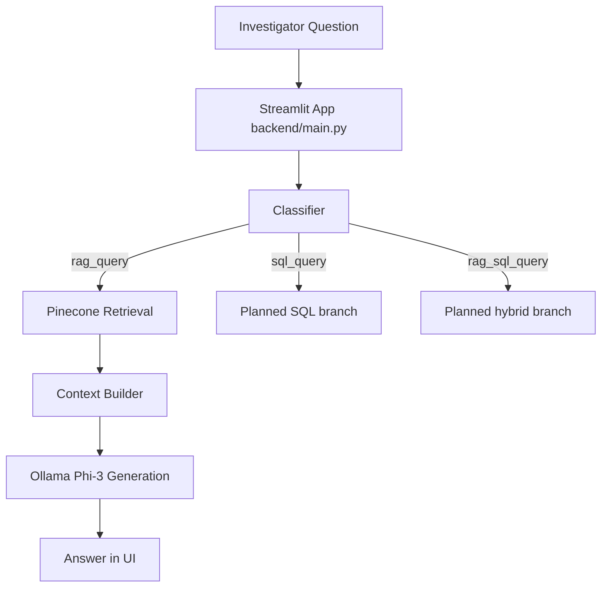
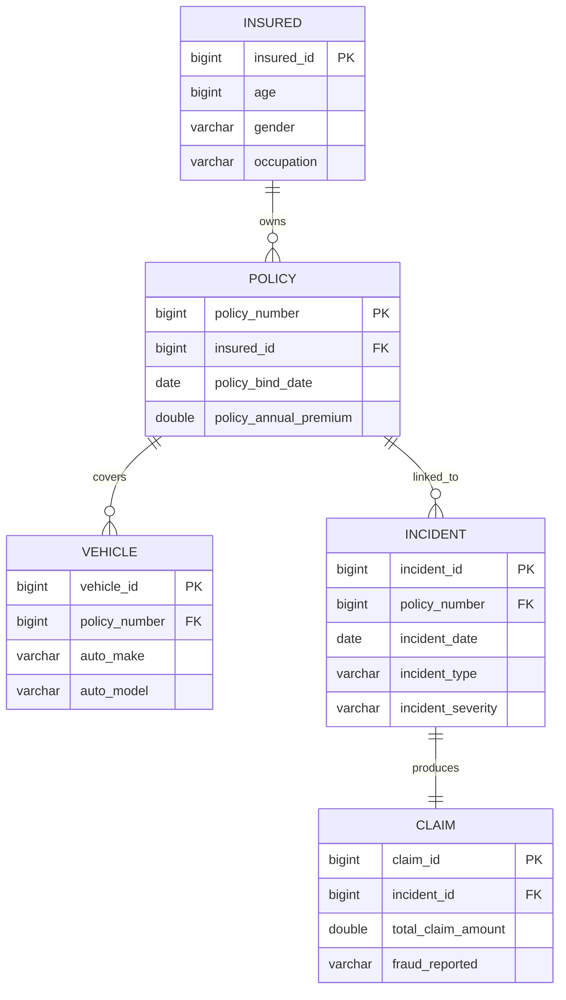

# ClaimShield AI

Insurance Claim Investigation using LLM Routing, Retrieval, and DuckDB


## Project Idea

Claim investigation teams often need to combine two different worlds:

- Structured claim and policy records
- Unstructured business rules, investigation notes, and guidance text

ClaimShield AI is designed to bridge both worlds. A user asks a plain-language question, the system classifies the question type, retrieves relevant evidence, and returns a clear answer grounded in retrieved context.

## What the Project Does

The assistant routes incoming questions into one of these labels:

1. sql_query
2. rag_query
3. rag_sql_query

Current implementation in this repository:

- rag_query: implemented end-to-end in the Streamlit assistant
- sql_query: classification present, execution path pending
- rag_sql_query: classification present, hybrid execution path pending

## End-to-End Flow



## System Components

| Layer | Module | Purpose |
| --- | --- | --- |
| UI | backend/main.py | Streamlit assistant interface and orchestration |
| Query Routing | backend/classifier.py | Classifies queries into sql_query, rag_query, rag_sql_query |
| Retrieval | backend/retrieval.py | Searches Pinecone index for context chunks |
| Ingestion | backend/ingestion.py | Splits data text files and uploads chunks to Pinecone |
| Structured Data | load_cleaned_data_to_duckdb.py | Builds DuckDB tables and analysis view from Excel |

## Repository Structure

```text
Cognexa/
       backend/
              classifier.py
              ingestion.py
              main.py
              retrieval.py
       data/
              entities.txt
              relationships.txt
              rules.txt
              Semantic_Insurance_Business_YAML.yaml
       frontend/
              app.py
       notebook/
              01_data_exploration.ipynb
              cognexa.ipynb
       insurance.duckdb
       insurance_duckdb_schema.sql
       load_cleaned_data_to_duckdb.py
       query_database.py
       query_duckdb.py
       test_duckdb.py
       requirements.txt
```

## Database Structure

Primary relational entities:

- insured
- policy
- vehicle
- incident
- claim

Entity relationship overview:



## Prerequisites

Install before setup:

1. Python 3.10+
2. Git
3. Ollama
4. Pinecone account with an index created

## Run on Your Machine (Windows PowerShell)

### 1. Clone and move into project

```powershell
git clone <your-repo-url>
cd Cognexa
```

### 2. Create and activate virtual environment

```powershell
python -m venv venv
.\venv\Scripts\Activate.ps1
```

### 3. Install dependencies

```powershell
pip install --upgrade pip
pip install -r requirements.txt
```

### 4. Create .env in project root

```env
PINECONE_API_KEY=YOUR_PINECONE_API_KEY
PINECONE_INDEX_NAME=cognexa-rag

# Optional telemetry
LANGSMITH_TRACING=false
LANGSMITH_API_KEY=
LANGSMITH_PROJECT=Cognexa
```

Important: never commit real keys or tokens.

### 5. Start Ollama and pull model

```powershell
ollama pull phi3
ollama serve
```

If Ollama is already running as a service, you only need ollama pull phi3 once.

### 6. Build Pinecone document index

```powershell
python backend/ingestion.py
```

### 7. Run the main assistant

```powershell
streamlit run backend/main.py
```

Open the URL printed by Streamlit, usually http://localhost:8501.

## DuckDB Pipeline (Structured Data)

Use this when you need the relational database locally.

### Input required

- cleaned_insurance_dataset.xlsx in project root
- Excel sheets named exactly: insured, policy, vehicle, incident, claim

### Build DB

```powershell
python load_cleaned_data_to_duckdb.py
```

This creates insurance_project.duckdb and a view named insurance_claim_analysis.

### Quick validation

```powershell
python query_duckdb.py
python test_duckdb.py
```

## Alternate UI (Prototype)

You can also run the lightweight UI scaffold:

```powershell
streamlit run frontend/app.py
```

This is currently a placeholder and not fully connected to a backend API endpoint.

## Example Questions

Try prompts like:

- What documents are required to file a motor insurance claim?
- Explain common fraud indicators in claim investigations.
- What are escalation rules for high-value claims?

## Troubleshooting

### Pinecone errors

- Verify PINECONE_API_KEY
- Verify PINECONE_INDEX_NAME exists
- Re-run ingestion after fixing .env

### Ollama connection issues

- Confirm ollama serve is running
- Confirm phi3 model is installed
- Default local endpoint used by code is http://localhost:11434

### No answer or empty retrieval

- Ensure ingestion completed successfully
- Ensure data text files exist in data folder

### DuckDB build fails

- Check Excel file exists in root
- Check sheet names match expected values exactly

## Team Workflow Recommendation

For group development:

1. Keep this README as the single source of setup truth.
2. Use feature branches for each module change.
3. Do not commit secrets in .env.
4. Update README whenever run steps change.

## Current Limitations

- sql_query execution branch is not implemented yet in the Streamlit orchestrator.
- rag_sql_query hybrid execution branch is not implemented yet.
- frontend/app.py is a starter interface.

## Roadmap

1. Implement SQL execution path over DuckDB.
2. Implement hybrid rag_sql_query path.
3. Add FastAPI service layer and wire frontend/app.py.
4. Add test coverage for routing, retrieval, and DB pipeline.

## Documentation Status

This repository now uses README.md as the primary project documentation file.
